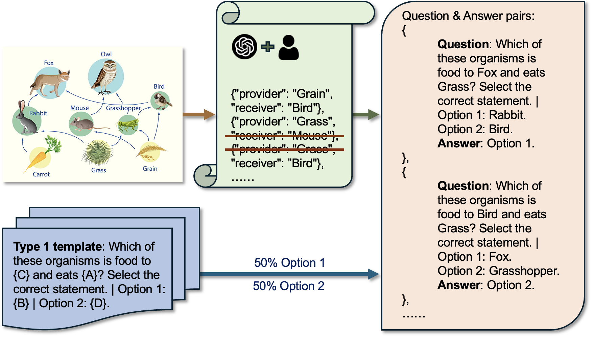

<h2 align="center" style="line-height: 50px;">
    Probing Logical Reasoning of MLLMs in Scientific Diagrams  
    EMNLP 2025
</h2>

  

* `data/`: 
  - `data/real/`:
  - `data/synthetic/`:
* `script/`:
  - `create_syn.py`:
